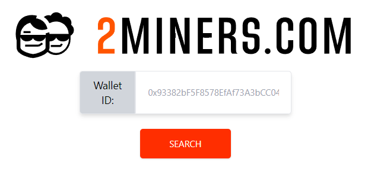
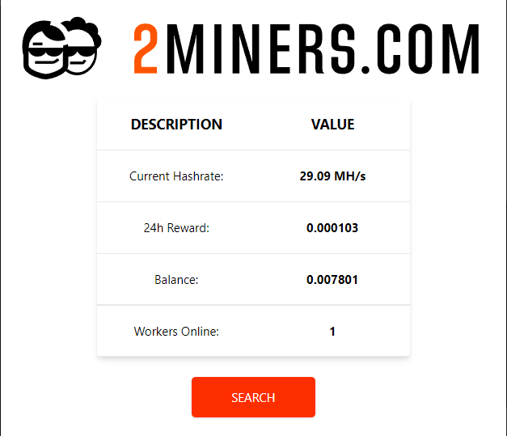

# Track the Progress of your Miners!
# Supports 2Miners and Flexpool but soon adding more

This is a browser extension to track progress of cryptominers using https://2miners.com API

## Getting Started
### Will be available on the Chrome Store within the next 3 weeks. Untill then:
  1. Click [here](https://github.com/luke-buttifant/2Miners-Browser-Extension/archive/refs/heads/main.zip) to download ZIP.
  2. Unzip the folder.
  3. Open Google Chrome and type this into the search bar: ``` chrome://extensions ```
  4. Enable Developer mode in the top right of the screen.
  5. drag and drop the 'dist' folder onto the page. 

### Done!! :partying_face: 

<p align="center" >
  
</p>
<br>
<p align="center">
  
</p>

## To Develop
1. ```yarn install ```
2. ```npm run watch```
3. Only edit 'src' folder. The dist folder will update automatically.

